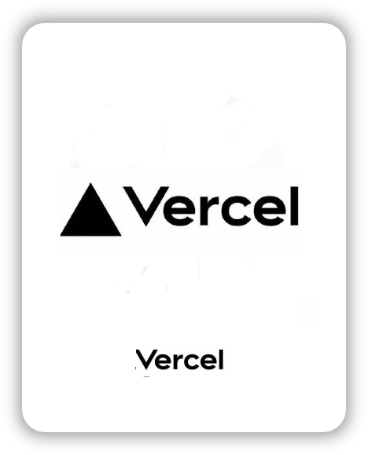

### Rolling 전통적인 롤링페이퍼 문화를 웹으로 구현한 커뮤니티형 플랫폼 🖍️

## 📝 소개

사용자는 친구나 동료들과 따뜻한 메시지를 주고받으며, 이를 통해
CRUD(Create, Read, Update, Delete) 기능을 직접 경험하게 됩니다.

이 프로젝트에서는 롤링페이퍼의 생성, 수정, 삭제뿐만 아니라 이모지 반응 기능을 추가해 감정 표현을 더 풍부하게 할 수 있습니다.

또한, 모달, 토스트와 같은 UI 요소를 활용하고, 글 입력에 외부 라이브러리를 적용해 사용자 경험을 개선할 수 있습니다

 

### 화면 구성

  <table style="white-space: nowrap;">
    <tr>
      <td align="center">
        <strong>메인 페이지</strong> 
        
        
롤링페이퍼 리스트 조회

      </td>
      <td align="center">
        <strong>디테일 페이지</strong> 
        
        
롤링 페이퍼 메시지 조회

      </td>
      <td align="center">
        <strong>디테일 페이지</strong> 
        
        
롤링 페이퍼 삭제 기능

      </td>
      <td align="center">
        <strong>디테일 페이지</strong> 
        
        
메세지 삭제 기능

      </td>
      <td align="center">
        <strong>디테일 페이지</strong> 
        
        
이모지 추가 기능

      </td>
      <td align="center">
        <strong>디테일 페이지</strong> 
        
        
url 공유 및 카카오톡 공유 기능

      </td>
      <td align="center">
        <strong>생성 페이지</strong> 
        
        
롤링 페이퍼 생성 기능

      </td>
      <td align="center">
        <strong>생성 페이지</strong> 
        
        
메세지 생성 기능

      </td>
    </tr> 
  </table>

 

## 🚀 시작하기

1. 의존성 설치

- `npm install`

- 📦 프로젝트에서 필요한 패키지를 설치합니다.

2. 로컬 서버 실행

- `npm start`
- 🖥️ 애플리케이션을 로컬 환경에서 실행합니다.

- 브라우저에서 http://localhost:3000으로 접속하세요.

 

## ⚙ 기술 스택

### Front-end

### Infra

### Tools

 

## ✏️ 컨벤션

- 커밋 메세지 - commitlint
- 코드 - eslint, prettier
- 스타일 가이드 - vercel style guide (Next.js의 개발사로서, React와 최적화된 생태계를 제공해서 결정)
- 추가적인 branch, commit 컨벤션의 내용은 다음 노션 링크에 있습니다.
  - https://lateral-curio-672.notion.site/15882b823a34816ca175f2a8a0d1d54d
     

## 🖥️ 역할분담

- 팀장 최성락
  - Main page, List Page 섹션 담당 - [롤링페이퍼] 조회 및 스크롤 처리
  - 공통 UI 제작, api-env처리, 이모지 및 카카오톡 url 공유처리 구현
  - 프로젝트 기초 셋팅 (eslint, husky, 파일구조)
- 팀원 강동욱

  - CreatePage 섹션 담당 - [메세지, 롤링 페이퍼] CREATE 구현

- 팀원 정재형
  - DetailPage 섹션 담당 - [메세지] 조회, 모달 구현
  - EditPage 섹션 담당 - [메세지, 롤링페이퍼] DELETE 구현,

 

## 💁‍♂️ 프로젝트 팀원

|                                            팀장                                             |                                            팀원                                             |                                                팀원                                                |
| :-----------------------------------------------------------------------------------------: | :-----------------------------------------------------------------------------------------: | :------------------------------------------------------------------------------------------------: |
|  |  |  |
|                             [최성락](https://github.com/rak517)                             |                             [강동욱](https://github.com/ko777y)                             |                             [정재형](https://github.com/jaehyeongjung)                             |

 

## 🔗 배포링크

https://rolling-swart.vercel.app/
